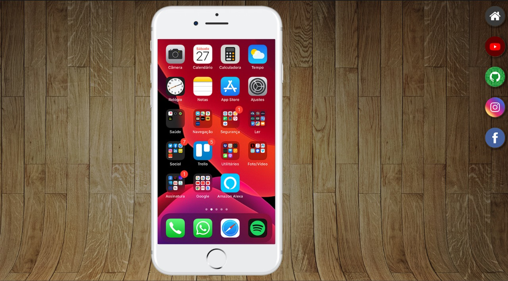

# Projeto Redes Sociais



Este projeto é uma página web interativa que exibe ícones das minhas redes sociais. Ao clicar nos ícones você poderá vê-las, e ao rolar até o final da página, os usuários podem clicar no botão e serem redirecionados para minhas redes sociais.

## Índice

- [Visão Geral](#visão-geral)
- [Funcionalidades](#funcionalidades)
- [Tecnologias Utilizadas](#tecnologias-utilizadas)
- [Instalação](#instalação)
- [Como Usar](#como-usar)
- [Estrutura do Projeto](#estrutura-do-projeto)
- [Contribuição](#contribuição)
- [Licença](#licença)
- [Contato](#contato)

## Visão Geral

Este projeto é uma página web interativa que dá acesso às minhas redes sociais de forma intuitiva. A página contém ícones das principais plataformas (como Facebook, Instagram, Youtube e Github), que, ao serem clicados, direcionam o usuário diretamente para os respectivos perfis. Além disso, ao rolar a página, o usuário encontra um botão que também facilita o acesso rápido a todas as redes sociais. O design foi pensado para ser simples, responsivo e de fácil navegação, garantindo uma experiência agradável em qualquer dispositivo.

## Funcionalidades

- **Ícones Interativos**: Ícones das redes sociais que exibem imagem das redes sociais.
- **Botão de Redirecionamento**: Um botão no final da página que redireciona para as redes sociais.
- **Design Responsivo**: A página é responsiva e se adapta a diferentes tamanhos de tela.

## Tecnologias Utilizadas

- **HTML**: Estrutura da página.
- **CSS**: Estilização da página e ícones.

## Instalação

Para rodar este projeto localmente, siga os passos abaixo:

1. Clone o repositório:
   ```bash
   git clone https://github.com/ajborgesdev/projeto-social.git
   ```
2. Navegue até o diretório do projeto:
   ```bash
   cd projeto-social
   ```
3. Abra o arquivo `index.html` no seu navegador:
   ```bash
   open index.html
   ```

## Como Usar

1. Abra a página no navegador.
2. Clique em qualquer um dos ícones para visualizar as páginas.
3. Role até o final da página e clique no botão para ser redirecionado para as redes sociais.

## Estrutura do Projeto

```
projeto-social/
├── estilo/
├── estilos/
│   ├── social.css
│   └── style.css
├── imagens/
│   ├── apresentacao-projetosocial.jpg
│   ├── frame-iphone.png
│   ├── fundo-madeira.jpg
│   ├── logo-facebook.jpg
│   ├── logo-github.jpg
│   ├── logo-home.jpg
│   ├── logo-instagram.jpg
│   ├── logo-youtube.jpg
│   ├── meu-facebook.png
│   ├── meu-github.png
│   ├── meu-instagram.png
│   ├── meu-youtube.png
│   └── tela-home.jpg
├── facebook.html
├── favicon.ico
├── github.html
├── home.html
├── index.html
├── instagram.html
├── LICENSE
├── readme.md
└── youtube.html
```

## Contribuição

Contribuições são bem-vindas! Siga os passos abaixo para contribuir:

1. Faça um fork do projeto.
2. Crie uma branch para sua feature (`git checkout -b feature/NovaFeature`).
3. Commit suas mudanças (`git commit -m 'Adiciona nova feature'`).
4. Faça push para a branch (`git push origin feature/NovaFeature`).
5. Abra um Pull Request.

## Licença

Este projeto está licenciado sob a Licença MIT - veja o arquivo [LICENSE](LICENSE) para mais detalhes.

## Contato

- **Ana Julia Borges** - [ajborges03@gmail.com](mailto:anajborges03@gmail.com)
- **GitHub** - [ajborgesdev](https://github.com/ajborgesdev)
- **LinkedIn** - [Ana Julia Borges](https://www.linkedin.com/in/ajborgesdev/)